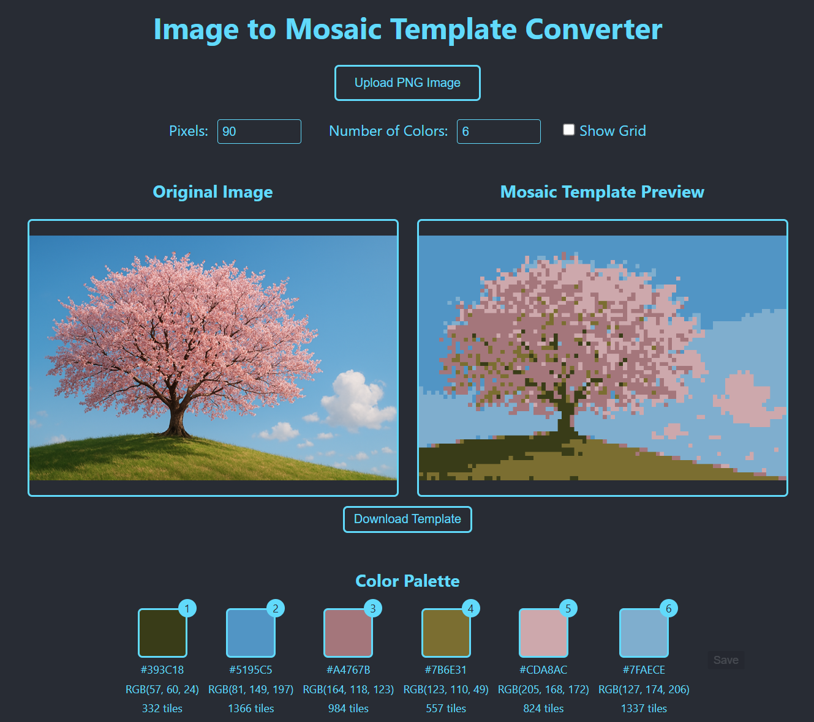

# Image to Mosaic Template Converter

A web-based tool that converts images into mosaic templates, perfect for pixel art and tile-based projects.

 <!-- Consider adding a screenshot -->

## Features

- 🖼️ Upload PNG images and convert them to mosaic templates
- 🎨 Customize the number of colors (1-256)
- 📏 Adjust pixel/tile dimensions
- 📊 Grid overlay with optional color numbers
- 🔍 Pan and zoom functionality for detailed viewing
- 🌓 Dark/Light mode support
- 📱 Responsive design
- 📊 Detailed statistics including:
  - Total tile count
  - Physical dimensions
  - Cost estimation
  - Color palette breakdown

## Usage

1. Visit [https://basemodmaker.github.io/image-to-mosaic-template/](https://basemodmaker.github.io/image-to-mosaic-template/)
2. Click "Upload PNG Image" to select your image
3. Adjust settings:
   - Pixel width for desired resolution
   - Number of colors for color quantization
   - Toggle grid and color number display
   - Set tile size and cost for calculations
4. Pan and zoom to inspect details
5. Download your mosaic template

## Project Information

This project is built using:
- React
- HTML Canvas for image processing
- CSS for styling

## Development

To run this project locally:

```bash
# Clone the repository
git clone https://github.com/basemodmaker/image-to-mosaic-template.git

# Install dependencies
npm install

# Start development server
npm start
```

## License

This project is licensed under the MIT License - see the [LICENSE](LICENSE) file for details.

## Contributing

Contributions are welcome! Please feel free to submit a Pull Request.

## Author

Base - [GitHub Profile](https://github.com/basemodmaker)

